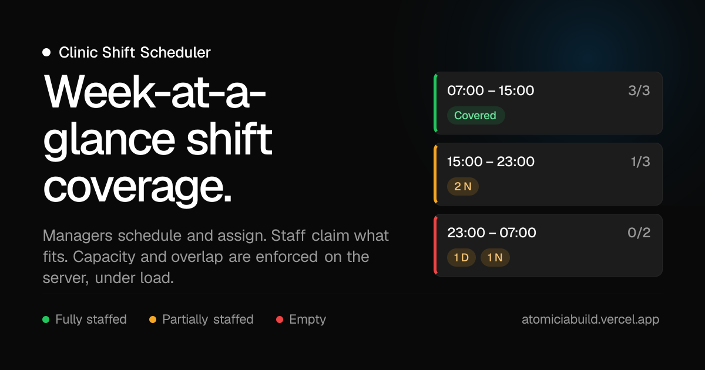

<div align="center">

<a href="https://atomiciabuild.vercel.app">
  
</a>

<p>
  <a href="https://atomiciabuild.vercel.app"></a>
  <a href="https://github.com/chahatkesh/atomiciabuild/actions/workflows/ci.yml"></a>
  
</p>

<p>
  
  
  
  
  
</p>

<p>
  <a href="#a-60-second-tour"><b>60-second tour</b></a> ·
  <a href="#how-the-brief-maps-to-the-app"><b>Brief → code</b></a> ·
  <a href="./DECISIONS.md"><b>33 decisions</b></a> ·
  <a href="./docs/architecture.md"><b>Architecture</b></a> ·
  <a href="./docs/concurrency.md"><b>Concurrency</b></a>
</p>

</div>

# Clinic Shift Scheduler

A clinic rota app built for the Atomicia Build take-home. Managers create, edit
and assign shifts and watch coverage week by week; staff claim the shifts that
fit them. Capacity and overlap rules are enforced on the server and hold under
concurrent load. The clinic's messy legacy spreadsheet is imported with a
row-by-row audit trail.

Sign in at **[atomiciabuild.vercel.app](https://atomiciabuild.vercel.app)** —
every account uses the password **`Clinic123!`**.

| Sign in as  | Email                              | What you'll see                                    |
| ----------- | ---------------------------------- | -------------------------------------------------- |
| **Manager** | `manager@clinicmail.test`          | Everything, including assignment and Import Report |
| **Nurse**   | `anya.haddad@clinicmail.test`      | Claim/leave nurse slots only                       |
| **Doctor**  | `marcus.whitfield@clinicmail.test` | Claim/leave doctor slots only                      |

## A 60-second tour

1. Sign in as the **manager**. You land on **Coverage** — the imported roster
   lives in August 2026, so if the current week is empty the page offers a
   one-click jump to the first scheduled week.
2. Switch the lens to **Needs staff** to hide everything already covered. Each
   card shows its window, `filled/required`, and chips counting who is still
   missing (D / N / R). Click one for the roster.
3. Go to **Shifts** and edit a shift that already has claims. The form warns you
   first; after saving you are told exactly who was released and why.
4. Open **Import Report** for the seed run — 158 rows read, with the original
   row, what was wrong with it, and what the importer did, for every one. Upload
   a CSV of your own on the same page; it runs through the identical pipeline.
5. Sign in as a **nurse** in another browser. The dashboard reframes as "Where
   you're needed" and defaults to the gaps. Try claiming two overlapping shifts,
   or a shift whose nurse slots are full — both are refused with a specific
   reason, by the server.

## How the brief maps to the app

| Requirement                                   | Where it lives                                                                               |
| --------------------------------------------- | -------------------------------------------------------------------------------------------- |
| Roles, professions, self-only claiming        | `modules/auth`, `app/api/shifts/[shiftId]/claim/route.ts`                                    |
| Shift CRUD, manager-only                      | `modules/shifts/shift.service.ts`, `requireManager()` on every write route                   |
| Capacity + overlap rules                      | `modules/claims/claim.service.ts` — one `claimShift()` for self-claim and manager assign     |
| Correct under concurrency                     | Transaction + conditional `$inc` + partial-unique index; see `DECISIONS.md` §19              |
| Re-validation after a shift edit              | `shift.service.ts` → `revalidateShiftClaims()`; only broken claims are released              |
| Dirty CSV import, seed + upload, same logic   | `modules/imports/import.service.ts` → `runImport()`, called by `scripts/seed.ts` and the API |
| Import Report, manager only                   | `/imports` (`requireManagerPage`) and all three `/api/import*` routes (`requireManager`)     |
| Week-at-a-glance, missing roles, jump-to-week | `modules/coverage`, `components/coverage/*`                                                  |
| Live updates (stretch)                        | 15s polling + refetch-on-focus behind `RealtimePort`; `DECISIONS.md` §24                     |

Recurring shifts are the one stretch goal not built — see
[Not built](#what-i-deliberately-did-not-build).

## Stack

| Layer       | Choice                                                          |
| ----------- | --------------------------------------------------------------- |
| Framework   | Next.js 16 (App Router, Turbopack)                              |
| UI          | Ant Design 6 + a Framer-inspired dark system (`docs/design.md`) |
| Database    | MongoDB Atlas via Mongoose 9                                    |
| Auth        | Auth.js v5 (Credentials + JWT sessions)                         |
| Validation  | Zod 4                                                           |
| Client data | TanStack Query (polling / refetch-on-focus)                     |
| Tests       | Vitest — 125 unit + integration                                 |
| Tooling     | pnpm, Husky, commitlint, lint-staged, GitHub Actions            |
| Deploy      | Vercel                                                          |

MongoDB was chosen for the document shape of shifts, claims and import audit
rows; the claim logic depends on **transactions**, so it needs a replica set —
Atlas or the bundled compose file, never a standalone `mongod`.

## Local setup

```bash
cp .env.example .env.local     # set MONGODB_URI and AUTH_SECRET (npx auth secret)

pnpm install
pnpm check:db                  # verifies the connection and that transactions work
pnpm seed                      # creates the manager and imports both clinic CSVs
pnpm dev
```

Open [http://localhost:3000](http://localhost:3000).

`pnpm seed` is idempotent, so re-running it is safe. `pnpm seed:reset` clears
shifts, claims and import history first and re-imports from scratch; staff
accounts survive either way.

**No Atlas cluster?** `docker compose up -d` starts a single-node replica set
locally with the URI already in `.env.example`, then follow the same steps.

### Environment variables

| Variable          | Required | Description                                            |
| ----------------- | -------- | ------------------------------------------------------ |
| `MONGODB_URI`     | Yes      | MongoDB connection string (Atlas or local replica set) |
| `AUTH_SECRET`     | Yes      | Auth.js secret (`npx auth secret`)                     |
| `AUTH_URL`        | Prod     | Public app URL                                         |
| `CLINIC_TIMEZONE` | No       | IANA timezone (default `America/Toronto`)              |
| `AUTH_TRUST_HOST` | No       | Set `true` behind proxies / on Vercel                  |

## Tests

```bash
pnpm test
```

125 tests in one command. Unit tests (time maths, week bounds, shift rules,
coverage aggregation, CSV normalizers, environment URL resolution) need nothing
but the repo and pass under a foreign timezone as well as the clinic's.

Integration tests cover what only breaks under real conditions: eight
simultaneous claims on a one-slot shift, two overlapping claims fired at the
same instant, claim re-validation after an edit, and import idempotency. They
use `MONGODB_URI` but always against a **separate database**
(`clinic_scheduler_integration_test`), so they cannot touch seeded data, and
they skip rather than fail when no cluster is reachable — which keeps CI green
without a live secret.

## What the importer did with the supplied CSVs

| File         | Rows | Accepted | Repaired | Merged | Rejected | Written |
| ------------ | ---- | -------- | -------- | ------ | -------- | ------- |
| `staff.csv`  | 41   | 16       | 18       | 3      | 4        | **34**  |
| `shifts.csv` | 117  | 35       | 50       | 27     | 5        | **85**  |

Repairs include `(at)` → `@`, whitespace and casing, role synonyms (`Dr`,
`RN`, `front desk`), and three date conventions disambiguated by separator.
Merges collapse rows describing the same `(date, start, end)` window, taking the
higher requirement per profession. Rejections are things no rule can save:
`2026-02-30`, an 18-hour window, a missing email, a role of "Janitor".

Every one of those verdicts is visible per row on the **Import Report** page.
The reasoning behind each policy is in `DECISIONS.md` §9, §21 and §22.

Any address from `docs/problem-statement/staff.csv` works as a login, provided
that row was accepted — the report lists the ones that were not.

## Scripts

| Command           | Purpose                                    |
| ----------------- | ------------------------------------------ |
| `pnpm dev`        | Start dev server                           |
| `pnpm build`      | Production build                           |
| `pnpm typecheck`  | TypeScript check                           |
| `pnpm lint`       | ESLint                                     |
| `pnpm test`       | Unit + integration tests                   |
| `pnpm check:db`   | Verify Mongo + transaction support         |
| `pnpm seed`       | Seed manager and import both CSVs          |
| `pnpm seed:reset` | Wipe shifts/claims/imports, then re-import |
| `pnpm seed:users` | Auth-only smoke seed (no CSV import)       |

## Deployment

Production is https://atomiciabuild.vercel.app, already seeded by the importer.

GitHub Actions owns the pipeline: `typecheck → lint → test → build`, then a
production deploy on push to `main`. Vercel's own Git auto-deploy is disabled
(`git.deploymentEnabled: false`) so nothing ships without passing CI. Details in
[docs/deployment.md](./docs/deployment.md).

**Cold starts:** the Atlas M0 free tier auto-pauses after 30 days idle and takes
a few seconds to wake, and Vercel functions cold-start in roughly 1–3s. The
first request after a quiet period can feel slow; everything after it is warm.

## What I deliberately did not build

**Recurring shifts.** The optional stretch goal. Doing it properly means a
series document plus per-occurrence overrides so that editing one Wednesday does
not fork the series, and that interacts with the claim re-validation rules in
ways worth designing rather than bolting on. I chose to spend the time on
concurrency correctness and the import audit trail instead, which the brief
weights more heavily.

**Notifying someone their claim was released.** This is the honest weak spot,
and it is the subject of the closing section of
[DECISIONS.md](./DECISIONS.md#one-thing-id-do-differently-with-more-time).

## Documentation

| Document                                             | Contents                                             |
| ---------------------------------------------------- | ---------------------------------------------------- |
| [DECISIONS.md](./DECISIONS.md)                       | 33 decisions, indexed by theme — start with the five |
| [docs/architecture.md](./docs/architecture.md)       | Layering, module boundaries, ESLint enforcement      |
| [docs/concurrency.md](./docs/concurrency.md)         | Why claims need transactions and a version bump      |
| [docs/import-pipeline.md](./docs/import-pipeline.md) | Normalizers, merge policy, verdict taxonomy          |
| [docs/data-model.md](./docs/data-model.md)           | Collections and indexes                              |
| [docs/api.md](./docs/api.md)                         | Every endpoint, its guard, and its response envelope |
| [docs/auth.md](./docs/auth.md)                       | Session strategy and where authorization happens     |
| [docs/testing.md](./docs/testing.md)                 | What is tested and why                               |
| [docs/design.md](./docs/design.md)                   | Design tokens and component patterns                 |
| [docs/roadmap.md](./docs/roadmap.md)                 | Phase plan with measured verification results        |
| [AGENTS.md](./AGENTS.md)                             | Conventions for anyone (or anything) editing this    |
