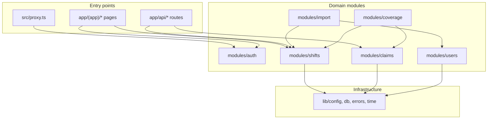

# Architecture

## Overview

Clinic Shift Scheduler is a layered Next.js application. All business rules live in `src/modules/*`; entry points in `src/app` stay thin.



## Directory structure

```
src/
├── app/                    # Routes and API handlers (thin)
│   ├── (auth)/login/
│   ├── (app)/              # Authenticated shell
│   └── api/
├── components/             # Presentational UI (no domain imports)
├── constants/              # App-wide constants
├── hooks/                  # Client hooks (realtime port, polling)
├── lib/                    # Infrastructure (db, env, errors, time)
├── modules/                # Domain logic
│   ├── auth/               # client.ts + server.ts split
│   ├── users/
│   ├── shifts/
│   ├── claims/
│   ├── import/
│   └── coverage/
├── providers/              # React context providers
└── types/                  # Shared TypeScript types
```

## Request flow

### Authenticated page

1. `proxy.ts` — optimistic redirect if no session cookie
2. `(app)/layout.tsx` — `requireUserPage()` loads session, renders `AppShell`
3. Page component — fetches data via server component or client query

### API mutation (e.g. claim shift)

1. `POST /api/shifts/:id/claims`
2. `requireUser()` or `requireManager()`
3. Zod validate body
4. `claimService.claimShift()` inside transaction
5. Return `{ data }` or `{ error: { code, message } }`

## Data flow principles

| Principle              | Implementation                                                    |
| ---------------------- | ----------------------------------------------------------------- |
| Single source of truth | MongoDB via Mongoose models                                       |
| Server enforcement     | All business rules in services                                    |
| Denormalized counters  | `shift.filled.{doctor,nurse,receptionist}` updated in transaction |
| Optimistic UI          | TanStack Query invalidation after mutation                        |
| Audit trail            | Import runs persist every row verdict                             |

## Serverless considerations

- **Connection caching:** `globalThis.mongooseCache` in `lib/db/connect.ts`
- **Transactions:** Required for claims; probed at `/api/health` and `pnpm check:db`
- **Cold starts:** Atlas M0 pause + Vercel function cold start may add latency on first request

## Module boundaries (Phase plan)

| Module     | Responsibility                  | Phase |
| ---------- | ------------------------------- | ----- |
| `auth`     | Login, session, guards          | 0 ✓   |
| `users`    | Staff/manager accounts          | 0 ✓   |
| `shifts`   | CRUD, time normalization        | 1     |
| `claims`   | Claim/unclaim, overlap/capacity | 2     |
| `import`   | CSV parse, merge, report        | 2     |
| `coverage` | Week-at-a-glance dashboard      | 3     |

## ESLint enforcement

- `components/**` cannot import `*.model.ts` or `*.service.ts`
- `app/**` cannot import `*.model.ts`
- `modules/**` cannot import `components/**`

See [auth.md](./auth.md), [data-model.md](./data-model.md), [concurrency.md](./concurrency.md).
