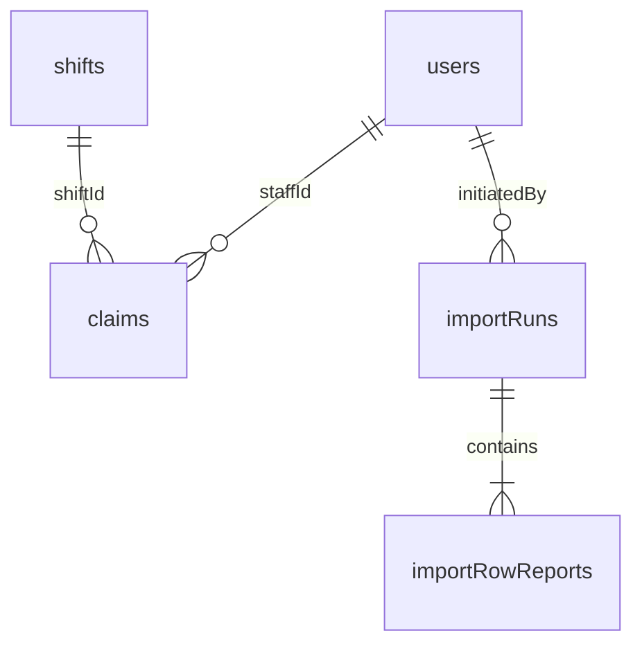

# Data Model

MongoDB collections (Mongoose). Phase 0 implements `users`; others are specified for upcoming phases.

## users

| Field                     | Type    | Notes                                              |
| ------------------------- | ------- | -------------------------------------------------- |
| `email`                   | string  | Unique, lowercase, identity key                    |
| `fullName`                | string  | Display name                                       |
| `role`                    | enum    | `manager` \| `staff`                               |
| `profession`              | enum?   | `doctor` \| `nurse` \| `receptionist` (staff only) |
| `passwordHash`            | string  | bcrypt                                             |
| `legacyStaffId`           | string? | From CSV import                                    |
| `version`                 | number  | Optimistic concurrency (claims)                    |
| `createdAt` / `updatedAt` | Date    | Timestamps                                         |

**Indexes:** `{ email: 1 }` unique

## shifts (Phase 1)

| Field            | Type     | Notes                                    |
| ---------------- | -------- | ---------------------------------------- |
| `date`           | string   | `YYYY-MM-DD` clinic-local                |
| `startTime`      | string   | `HH:mm` or `HH:mm+1`                     |
| `endTime`        | string   | `HH:mm` or `HH:mm+1`                     |
| `startAt`        | Date     | UTC derived                              |
| `endAt`          | Date     | UTC derived (overnight aware)            |
| `requirements`   | object   | `{ doctor, nurse, receptionist }` counts |
| `filled`         | object   | Denormalized active claim counts         |
| `legacyShiftIds` | string[] | Source CSV IDs (may be merged)           |
| `version`        | number   | Optimistic concurrency                   |

**Indexes:** `{ startAt: 1, endAt: 1 }`, `{ date: 1 }`

## claims (Phase 2)

| Field                     | Type     | Notes                           |
| ------------------------- | -------- | ------------------------------- |
| `shiftId`                 | ObjectId | ref shifts                      |
| `staffId`                 | ObjectId | ref users                       |
| `profession`              | enum     | At time of claim                |
| `status`                  | enum     | `active` \| `released`          |
| `releaseReason`           | string?  | Why released (shift edit, etc.) |
| `assignedByManager`       | boolean  | Direct assignment flag          |
| `createdAt` / `updatedAt` | Date     |                                 |

**Indexes:** `{ shiftId: 1, staffId: 1 }` unique, `{ staffId: 1, status: 1 }`

## importRuns (Phase 2)

| Field                       | Type     | Notes                                             |
| --------------------------- | -------- | ------------------------------------------------- |
| `initiatedBy`               | ObjectId | Manager user                                      |
| `startedAt` / `completedAt` | Date     |                                                   |
| `summary`                   | object   | `{ accepted, repaired, merged, rejected }` counts |
| `rows`                      | array    | Per-row verdict (embedded or separate collection) |

## importRowReports (optional sub-collection)

| Field         | Type     | Notes                                              |
| ------------- | -------- | -------------------------------------------------- |
| `importRunId` | ObjectId |                                                    |
| `source`      | enum     | `staff` \| `shifts`                                |
| `rowNumber`   | number   | 1-based CSV row                                    |
| `raw`         | object   | Original row data                                  |
| `verdict`     | enum     | `accepted` \| `repaired` \| `merged` \| `rejected` |
| `message`     | string   | Human-readable explanation                         |

## Relationships

## Denormalization

`shift.filled` counters are updated atomically inside claim transactions. Source of truth for _who_ claimed is the `claims` collection; counters are a read optimization and validation aid.
