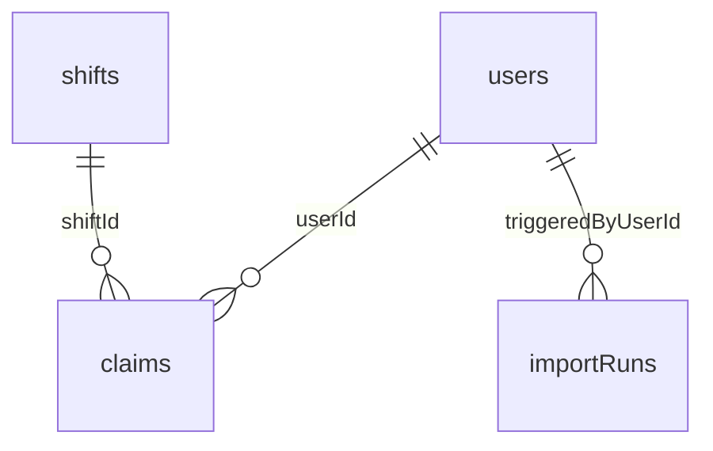

# Data Model

MongoDB collections (Mongoose). All four collections are implemented.

## users

| Field                     | Type    | Notes                                              |
| ------------------------- | ------- | -------------------------------------------------- |
| `email`                   | string  | Unique, lowercase, identity key                    |
| `fullName`                | string  | Display name                                       |
| `role`                    | enum    | `manager` \| `staff`                               |
| `profession`              | enum?   | `doctor` \| `nurse` \| `receptionist` (staff only) |
| `passwordHash`            | string  | bcrypt                                             |
| `legacyStaffId`           | string? | From CSV import                                    |
| `version`                 | number  | Optimistic concurrency (claims)                    |
| `createdAt` / `updatedAt` | Date    | Timestamps                                         |

**Indexes:** `{ email: 1 }` unique

## shifts (implemented)

| Field            | Type     | Notes                                    |
| ---------------- | -------- | ---------------------------------------- |
| `date`           | string   | `YYYY-MM-DD` clinic-local                |
| `startTime`      | string   | `HH:mm` or `HH:mm+1`                     |
| `endTime`        | string   | `HH:mm` or `HH:mm+1`                     |
| `startAt`        | Date     | UTC derived                              |
| `endAt`          | Date     | UTC derived (overnight aware)            |
| `requirements`   | object   | `{ doctor, nurse, receptionist }` counts |
| `filled`         | object   | Denormalized active claim counts         |
| `legacyShiftIds` | string[] | Source CSV IDs (may be merged)           |
| `version`        | number   | Optimistic concurrency                   |

**Indexes:** `{ startAt: 1, endAt: 1 }`, `{ date: 1 }`,
and `{ date: 1, startAt: 1, endAt: 1 }` unique.

The unique compound index is the importer's natural key: one shift per clinic
time window. It is what turns the CSV's conflicting duplicate rows
(5098 vs 5099) into a merge rather than two competing shifts, and it makes
`POST /api/shifts` return `409` instead of silently double-booking a slot.

## claims (implemented)

| Field                     | Type      | Notes                                     |
| ------------------------- | --------- | ----------------------------------------- |
| `shiftId`                 | ObjectId  | ref shifts                                |
| `userId`                  | ObjectId  | ref users                                 |
| `profession`              | enum      | Denormalized at claim time                |
| `status`                  | enum      | `active` \| `released`                    |
| `source`                  | enum      | `self` \| `manager`                       |
| `assignedByUserId`        | ObjectId? | The manager, when assigned                |
| `releasedAt`              | Date?     |                                           |
| `releaseReason`           | string?   | Why released (edit, deletion, by manager) |
| `createdAt` / `updatedAt` | Date      | `createdAt` is the seniority tiebreak     |

**Indexes:**

- `{ shiftId: 1, userId: 1 }` unique, **partial on `status: "active"`**
- `{ userId: 1, status: 1 }`
- `{ shiftId: 1, status: 1 }`

The partial filter matters: a plain unique index would forbid re-claiming a
shift someone had previously left. Restricting uniqueness to active claims keeps
double-claiming impossible while leaving the release/re-claim cycle open, and
preserves released claims as history.

`profession` is copied onto the claim rather than read from the user so the
capacity maths needs no join, and so a later re-import correcting someone's role
cannot silently rewrite what they were rostered as.

## importRuns (implemented)

Row reports are embedded rather than kept in a second collection: a run is read
whole by the report page, and 158 rows sit far inside the 16MB document limit.

| Field                      | Type      | Notes                                               |
| -------------------------- | --------- | --------------------------------------------------- |
| `source`                   | enum      | `seed` \| `upload`                                  |
| `fileName`                 | string?   | Uploaded file name(s)                               |
| `triggeredByUserId`        | ObjectId? | Manager, for uploads                                |
| `startedAt` / `finishedAt` | Date      |                                                     |
| `totals`                   | object    | `{ total, accepted, repaired, merged, rejected }`   |
| `sections[]`               | array     | One per file: `kind`, `counts`, `persisted`, `rows` |
| `sections[].rows[]`        | array     | `rowNumber`, `raw`, `verdict`, `issues[]`, `action` |

**Indexes:** `{ createdAt: -1 }`

## Relationships

## Denormalization

`shift.filled` counters are updated atomically inside claim transactions, using
a conditional `$expr` filter that re-checks capacity at write time. The `claims`
collection remains the source of truth for _who_ is on a shift; the counters are
a read optimization and the enforcement point for capacity.

They are recomputed from surviving claims whenever a shift is edited, so an edit
cannot leave the counter disagreeing with reality.
