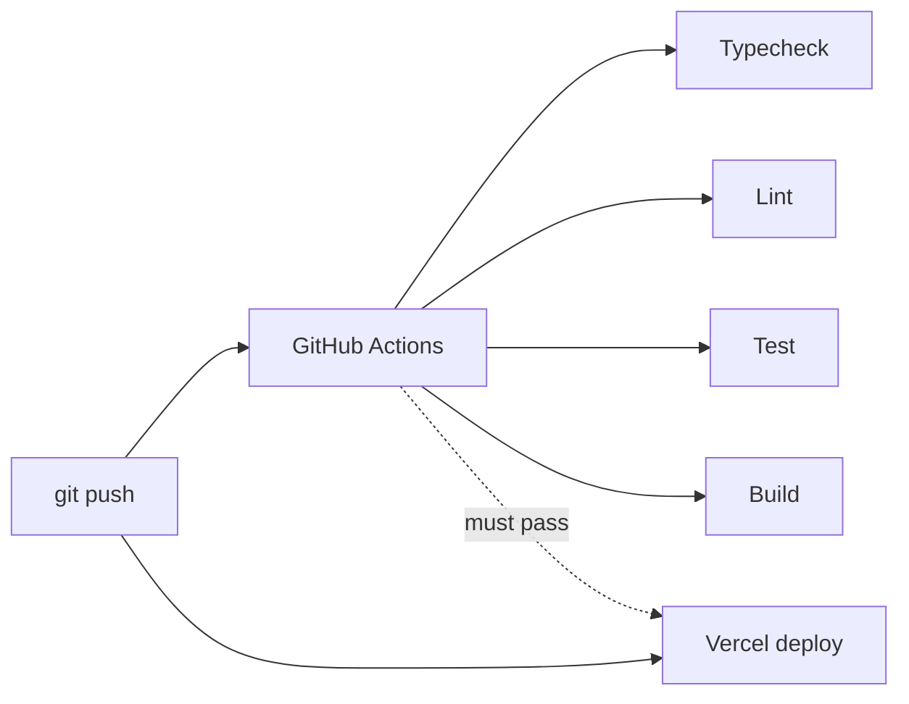

# Deployment

## Target: Vercel + MongoDB Atlas

### Vercel setup

1. Import GitHub repository
2. Framework preset: **Next.js** (auto-detected)
3. Install command: `pnpm install` (from `vercel.json`)
4. Build command: `pnpm build`

### Environment variables (Vercel dashboard)

| Variable          | Value                             |
| ----------------- | --------------------------------- |
| `MONGODB_URI`     | Atlas connection string (you add) |
| `AUTH_SECRET`     | Random 32+ char secret            |
| `AUTH_URL`        | `https://your-app.vercel.app`     |
| `CLINIC_TIMEZONE` | `America/Toronto`                 |
| `AUTH_TRUST_HOST` | `true`                            |

### Atlas setup

1. Create free M0 cluster
2. Database user with read/write on `clinic-scheduler` db
3. Network access: allow `0.0.0.0/0` (or Vercel IP ranges for production hardening)
4. Connection string → `MONGODB_URI`

### Post-deploy seeding

Run locally against Atlas URI:

```bash
MONGODB_URI="mongodb+srv://..." pnpm seed:users
# Phase 2: pnpm seed:import
```

Or add a one-time Vercel deploy hook / manual script run.

## CI/CD pipeline



`.github/workflows/ci.yml` runs on push/PR to `main`.

Vercel Git integration deploys on push (configure to wait for CI if desired).

## Local production parity

```bash
docker compose up -d     # Mongo replica set
cp .env.example .env.local
pnpm seed:users
pnpm build && pnpm start
```

## Cold starts & limits

| Factor                         | Impact                                         |
| ------------------------------ | ---------------------------------------------- |
| Vercel serverless cold start   | First request after idle ~1-3s                 |
| Atlas M0 auto-pause (30d idle) | First connection after pause ~5-10s            |
| M0 rate limit (~100 ops/sec)   | Heavy polling + concurrent claims may throttle |
| M0 connection limit (500)      | Unlikely at demo scale; pool capped at 10      |

Document in README if deployed URL experiences cold starts.

## Monitoring (future)

- `/api/health` for uptime checks
- Vercel Analytics (optional)
- Structured logging via `lib/logger` (console for now)

## Security checklist

- [ ] `AUTH_SECRET` is unique per environment
- [ ] MongoDB user has minimal privileges
- [ ] No secrets in git
- [ ] HTTPS enforced (Vercel default)
