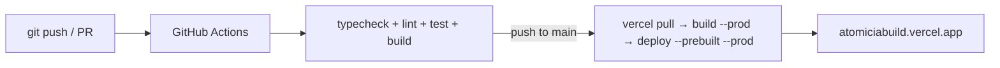

# Deployment

## Target: Vercel + MongoDB Atlas

**Live project:** [chahat-kesharwanis-projects/atomiciabuild](https://vercel.com/chahat-kesharwanis-projects/atomiciabuild)  
**GitHub repo:** [chahatkesh/atomiciabuild](https://github.com/chahatkesh/atomiciabuild)  
**Production URL:** https://atomiciabuild.vercel.app

Local and production both use the same Atlas database (`atomiciabuild`).

### One-time CLI setup (already done)

```bash
# Link local checkout
vercel link --yes --project atomiciabuild --scope chahat-kesharwanis-projects

# Connect GitHub (comments / project link; auto Git deploys disabled — CD is Actions)
vercel git connect https://github.com/chahatkesh/atomiciabuild.git

# Env vars (production / preview / development)
vercel env add MONGODB_URI production,preview --sensitive
vercel env add AUTH_SECRET production,preview --sensitive
vercel env add MONGODB_URI development --no-sensitive
vercel env add AUTH_SECRET development --no-sensitive
vercel env add CLINIC_TIMEZONE production,preview,development --no-sensitive
vercel env add AUTH_TRUST_HOST production,preview,development --no-sensitive
vercel env add AUTH_URL production   # https://atomiciabuild.vercel.app
```

### GitHub Actions secrets (required for CD)

| Secret              | Value                              |
| ------------------- | ---------------------------------- |
| `VERCEL_TOKEN`      | Vercel personal/CLI auth token     |
| `VERCEL_ORG_ID`     | `team_3XkixXUIAAA1eJ7uEmvnuzHx`    |
| `VERCEL_PROJECT_ID` | `prj_xos3OZ3vrMmK2fGXp9xu12A3FKni` |

Set via:

```bash
gh secret set VERCEL_TOKEN -R chahatkesh/atomiciabuild
gh secret set VERCEL_ORG_ID -R chahatkesh/atomiciabuild --body "team_3XkixXUIAAA1eJ7uEmvnuzHx"
gh secret set VERCEL_PROJECT_ID -R chahatkesh/atomiciabuild --body "prj_xos3OZ3vrMmK2fGXp9xu12A3FKni"
```

### Environment variables

| Variable          | Local (`.env.local`)    | Vercel                                    |
| ----------------- | ----------------------- | ----------------------------------------- |
| `MONGODB_URI`     | Atlas `atomiciabuild`   | Same Atlas URI (prod/preview/dev)         |
| `AUTH_SECRET`     | Dev secret              | Dedicated secret (prod/preview/dev)       |
| `AUTH_URL`        | `http://localhost:3000` | `https://atomiciabuild.vercel.app` (prod) |
| `CLINIC_TIMEZONE` | `America/Toronto`       | `America/Toronto`                         |
| `AUTH_TRUST_HOST` | `true`                  | `true`                                    |

### Manual / CLI deploy

```bash
vercel --prod --scope chahat-kesharwanis-projects
```

### Post-deploy seeding

The brief requires the deployed site to be pre-populated by the importer, so the
full seed — manager account plus both clinic CSVs — is the one to run:

```bash
# Uses MONGODB_URI from .env.local (Atlas, shared with production)
pnpm seed          # idempotent; safe to re-run
pnpm seed:reset    # wipe shifts/claims/import runs first, then re-import
```

`pnpm seed:users` only creates the four original demo accounts and imports
nothing. It exists for auth-only smoke tests, not for a real deploy.

## CI/CD pipeline

Deployments are driven entirely by GitHub Actions (`.github/workflows/ci.yml`).  
`vercel.json` sets `"git": { "deploymentEnabled": false }` so Vercel does **not** also deploy on push (avoids double deploys).



| Stage         | Job                 | Trigger                           |
| ------------- | ------------------- | --------------------------------- |
| CI            | `quality`           | push / PR                         |
| CD production | `deploy-production` | after `quality` on push to `main` |

## Local production parity

```bash
cp .env.example .env.local
# Set MONGODB_URI to the Atlas connection string
pnpm install
pnpm check:db
pnpm seed
pnpm build && pnpm start
```

Docker Compose Mongo is optional now that local/prod share Atlas; keep it if you need an offline replica set.

## Cold starts & limits

| Factor                         | Impact                                         |
| ------------------------------ | ---------------------------------------------- |
| Vercel serverless cold start   | First request after idle ~1-3s                 |
| Atlas M0 auto-pause (30d idle) | First connection after pause ~5-10s            |
| M0 rate limit (~100 ops/sec)   | Heavy polling + concurrent claims may throttle |
| M0 connection limit (500)      | Unlikely at demo scale; pool capped at 10      |

## Monitoring

- `/api/health` for uptime checks
- Vercel dashboard deployment logs
- GitHub Actions run logs for CI/CD
- Structured logging via `lib/logger` (console for now)

## Security checklist

- [x] `AUTH_SECRET` set in Vercel (not committed)
- [x] `MONGODB_URI` stored as sensitive on Production/Preview
- [x] `VERCEL_TOKEN` / org / project IDs in GitHub Actions secrets
- [x] No secrets in git (`.env.local` / `.vercel` gitignored)
- [x] HTTPS enforced (Vercel default)
- [ ] Rotate Atlas password if URI was shared in chat/docs
