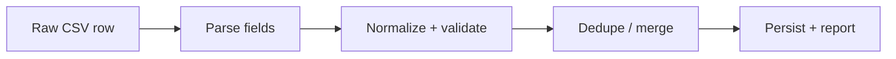

# Import Pipeline

Automatic seed import + manager UI upload using the same normalization logic.

## Sources

- `docs/problem-statement/staff.csv` — 41 data rows
- `docs/problem-statement/shifts.csv` — 117 data rows

## Pipeline stages



Every row gets a verdict: `accepted` | `repaired` | `merged` | `rejected`.

## Staff CSV rules

| Issue              | Example rows                                         | Action                                 |
| ------------------ | ---------------------------------------------------- | -------------------------------------- |
| Role aliases       | `Doctor`, `MD`, `Physician`, `RN`, `NURSE`, `recep.` | Map to `doctor`/`nurse`/`receptionist` |
| Whitespace         | `  Karan ALI`, `Nurse`                               | Trim                                   |
| Email repair       | `priya.weber(at)clinicmail.test`                     | Replace `(at)` → `@`                   |
| Duplicate staff_id | 103, 110 (exact dupes)                               | Merge; keep first                      |
| Duplicate email    | 998 shares email with 107                            | Reject or merge by policy              |
| Missing name       | 996 (empty name)                                     | Reject                                 |
| Missing email      | 995 (empty email)                                    | Reject                                 |
| Unknown role       | 997 Janitor                                          | Reject                                 |
| Unknown staff_id   | 999, 995–998                                         | Accept if otherwise valid              |

**Identity key:** normalized email.

## Shifts CSV rules

| Issue                   | Example rows                                     | Action                                 |
| ----------------------- | ------------------------------------------------ | -------------------------------------- |
| Date formats            | `2026-08-28`, `29/08/2026`, `08-13-2026`         | ISO / dd/MM/yyyy / MM-dd-yyyy          |
| Invalid date            | 5110 `2026-02-30`                                | Reject                                 |
| Missing start           | 5114 empty start_time                            | Reject                                 |
| End before start        | 5109 `15:00`–`09:00`                             | Reject (unless overnight intent clear) |
| Zero duration           | 5112 `12:00`–`12:00`                             | Reject                                 |
| Overnight               | 5050 `22:00`–`06:00`                             | `endAt` next day                       |
| Midnight end            | 5078 `16:00`–`00:00`                             | `endAt` next day                       |
| +1 notation             | 5115 `10:00+1`                                   | Start next day                         |
| Requirements text       | 5113 `two nurses and a doctor`                   | Parse or reject                        |
| Partial requirements    | 5110 `nurses=2;doctors=1` (no receptionists)     | Default missing roles to 0             |
| Duplicate shift_id      | 5020 (appears twice)                             | Merge or dedupe                        |
| Conflicting same window | 5098 vs 5099 (same date, 14:00–22:00, diff reqs) | **Merge: max per profession**          |
| Conflicting same window | 5073 vs 5075, 5077 vs 5080                       | Same merge rule                        |

## Merge policy (conflicting rows)

Natural key: `(date, startAt, endAt)`.

When two rows share the key but differ in requirements:

```
merged.doctor = max(a.doctor, b.doctor)
merged.nurse = max(a.nurse, b.nurse)
merged.receptionist = max(a.receptionist, b.receptionist)
legacyShiftIds = [both source IDs]
verdict = "merged"
```

## Import run persistence

Each run creates an `importRuns` document with:

- Counts: accepted, repaired, merged, rejected
- Full row-level report for the Import Report page

## Seed integration

`scripts/seed-users.ts` seeds login accounts (Phase 0).

Phase 2 adds `scripts/seed-import.ts` calling the same `importService.importFromFiles()` used by the manager upload UI, ensuring deployed site is pre-populated.

## Manager UI (Phase 2)

- Upload `.csv` via antd `Upload`
- POST `/api/import` with multipart form
- Redirect to Import Report showing latest run

## Error messages

Every rejected row includes:

- Original row data (as parsed)
- Specific reason ("Invalid date: 2026-02-30", "Unknown role: Janitor", etc.)
- Action taken ("Rejected", "Merged with shift 5099")
