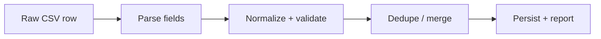

# Import Pipeline

Automatic seed import + manager UI upload using the same normalization logic.

## Sources

- `docs/problem-statement/staff.csv` — 41 data rows
- `docs/problem-statement/shifts.csv` — 117 data rows

## Pipeline stages



Every row gets a verdict: `accepted` | `repaired` | `merged` | `rejected`.

## Staff CSV rules

| Issue              | Example rows                                         | Action                                 |
| ------------------ | ---------------------------------------------------- | -------------------------------------- |
| Role aliases       | `Doctor`, `MD`, `Physician`, `RN`, `NURSE`, `recep.` | Map to `doctor`/`nurse`/`receptionist` |
| Whitespace         | `  Karan ALI`, `Nurse`                               | Trim                                   |
| Email repair       | `priya.weber(at)clinicmail.test`                     | Replace `(at)` → `@`                   |
| Duplicate staff_id | 103, 110 (exact dupes)                               | Merge; keep first                      |
| Duplicate email    | 998 shares email with 107                            | Reject — different person, same email  |
| Missing name       | 996 (empty name)                                     | Reject                                 |
| Missing email      | 995 (empty email)                                    | Reject                                 |
| Unknown role       | 997 Janitor                                          | Reject                                 |
| Unknown staff_id   | 999, 995–998                                         | Accept if otherwise valid              |

**Identity key:** normalized email.

## Shifts CSV rules

| Issue                   | Example rows                                      | Action                                 |
| ----------------------- | ------------------------------------------------- | -------------------------------------- |
| Date formats            | `2026-08-28`, `29/08/2026`, `08-13-2026`          | ISO / dd/MM/yyyy / MM-dd-yyyy          |
| Invalid date            | 5110 `2026-02-30`                                 | Reject                                 |
| Missing start           | 5114 empty start_time                             | Reject                                 |
| End before start        | 5109 `15:00`–`09:00`                              | Reject (unless overnight intent clear) |
| Zero duration           | 5112 `12:00`–`12:00`                              | Reject                                 |
| Overnight               | 5050 `22:00`–`06:00`                              | `endAt` next day                       |
| Midnight end            | 5078 `16:00`–`00:00`                              | `endAt` next day                       |
| +1 notation             | 5115 end `10:00+1`                                | Parsed as next day → 26h → **reject**  |
| Requirements text       | 5113 `two nurses and a doctor`                    | Parsed to nurses=2, doctors=1          |
| Partial requirements    | 5111 `nurses=2` (no doctors/receptionists)        | Default missing roles to 0             |
| Duplicate shift_id      | 5020 (appears twice)                              | Merge (exact duplicate)                |
| Conflicting same window | 5098 vs 5099 (same date, 14:00–22:00, diff reqs)  | **Merge: max per profession**          |
| Conflicting same window | 27 rows in total, incl. 3-way on Aug 4 and Aug 19 | Same merge rule                        |

### Note on 5115

`08:00` to `10:00+1` is a 26-hour span. The `+1` notation is understood — the
row report says so — but the result still breaks the 16-hour limit from
DECISIONS.md §16, so the row is rejected with `spans 26h` rather than silently
creating a shift nobody could work.

## Actual results

Produced by `pnpm seed` against the supplied files:

| File         | Rows | Accepted | Repaired | Merged | Rejected | Written |
| ------------ | ---- | -------- | -------- | ------ | -------- | ------- |
| `staff.csv`  | 41   | 16       | 18       | 3      | 4        | 34      |
| `shifts.csv` | 117  | 35       | 50       | 27     | 5        | 85      |

**Rejected staff:** 997 (Janitor), 995 (no email), 996 (no name), 998 (email
belongs to Hiro Iyer).

**Rejected shifts:** 5110 (`2026-02-30`), 5109 (18h), 5115 (26h), 5114 (no start
time), 5112 (zero length).

**Merged staff:** the two exact duplicates (103, 110) plus 105, which is the
same person as 999 under a second staff_id.

## Merge policy (conflicting rows)

Natural key: `(date, startAt, endAt)`.

When two rows share the key but differ in requirements:

```
merged.doctor = max(a.doctor, b.doctor)
merged.nurse = max(a.nurse, b.nurse)
merged.receptionist = max(a.receptionist, b.receptionist)
legacyShiftIds = [both source IDs]
verdict = "merged"
```

## Import run persistence

Each run creates an `importRuns` document with:

- Counts: accepted, repaired, merged, rejected
- Full row-level report for the Import Report page

## Seed integration

`scripts/seed.ts` (`pnpm seed`) creates the manager account and calls the same
`runImport()` the manager upload uses, so the deployed site and an ad-hoc upload
can never behave differently.

Re-running is safe. Staff upsert by email, and shifts upsert by
`(date, startAt, endAt)` using `$max` on requirements — a re-import can raise a
requirement but never lower one, so live claims stay valid. `pnpm seed:reset`
clears shifts, claims and import history first when a clean demonstration is
wanted.

## Manager UI

`/imports` (manager only):

- Drag-and-drop one or both CSVs; the file type is detected from its headers
- `POST /api/import` as multipart form data
- The run appears immediately, with a verdict filter and every row's original
  data, what was wrong, and what the importer did
- Earlier runs are selectable from the same page

## Error messages

Every rejected row includes:

- Original row data (as parsed)
- Specific reason ("Invalid date: 2026-02-30", "Unknown role: Janitor", etc.)
- Action taken ("Rejected", "Merged with shift 5099")
